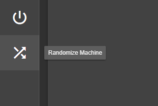
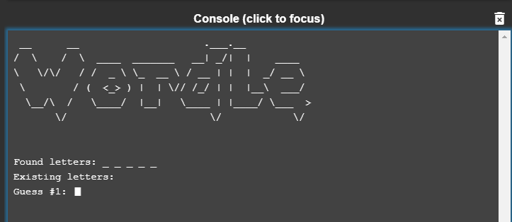
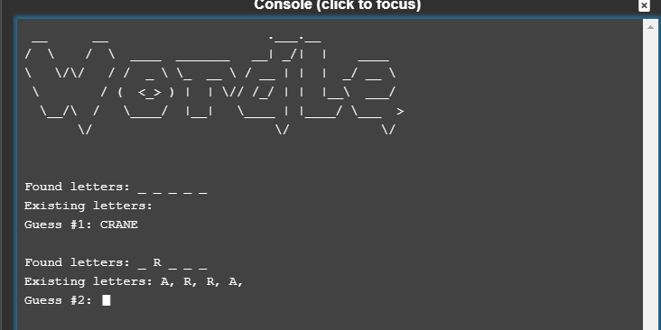

# Wordle

CS155 Final Project by Niall Murray. LC-3 recreation of The New York Time's hit game Wordle. 5/6/2025

## HOW TO RUN

Step 1: Copy the assembly code and paste into the LC-3 simulator. Assemble it.

Step 2: Hit the "Randomize Machine" button before refreshing the simulator.

Step 3: Hit play and have fun!

## HOW TO PLAY

When starting the game, you'll be greeted with a title card and a 5 space prompt for you to type your first guess in.

Off the bat, you'll notice you're on your 1st of 6 total guesses to guess the correct word! Once you input your first
guess, it'll auto send on the 5th character and the game will process it. Any correct letters found in the guess that
are ALSO in the right spot, it'll lock it in for you to reference! Any correct letters that aren't in the right spot
will be listed out underneath for you to remember.

If you make a typo, don't worry! Just press **backspace** to clear your guess and have another try!

---------------------------------------------------------------------------------------------------

Have fun guessing!